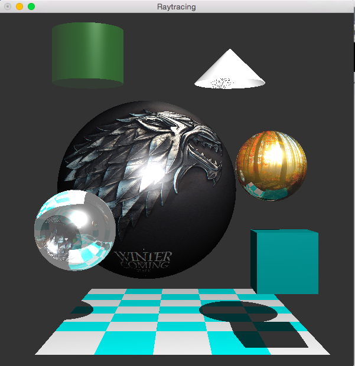

# Ray Tracing 
Assignment for COSC363 Computer Graphics at University of Canterbury in Spring 2016.
Rendering of a raytraced scene. Includes rendering of several objects, including spheres, a cylinder, and a cone. Implementation of a transparent and refractive effect to one of the spheres.Procedural Texture mapping also implemented.

  

